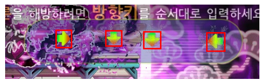
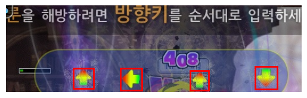
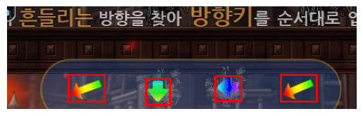

# ArrowDetector


ArrowDetector is a Python-based tool for detecting arrows in images using **Ultralytics YOLOv11** computer vision model. This tool can identify different types of arrows (directional and rotational) with high accuracy and provides detailed detection results.






<br>

## 🎯 Features

- 🔍 **High-accuracy arrow detection** using Ultralytics YOLOv11
- 🎨 **Multiple arrow types supported**: directional arrows (left, down, right, up) and rotational arrows
- 📊 **Detailed detection results** with bounding boxes and confidence scores
- 🌐 **REST API integration** for easy web service deployment
- 🖼️ **Multiple image format support** (JPG, PNG, etc.)
- ⚡ **Fast inference** with optimized YOLOv11 model

## 🚀 Technology Stack

- **Deep Learning Framework**: Ultralytics YOLOv11
- **Backend**: Python FastAPI
- **Computer Vision**: OpenCV
- **Model Training**: Custom dataset with arrow annotations


## 📋 Usage

### API Request Example

```python
import requests

# API endpoint
url = "https://arrowdetector.onrender.com/predict"

# Image file path
image_path = "test3.jpg"

# Send POST request with image file
with open(image_path, "rb") as f:
    files = {"file": f}
    response = requests.post(url, files=files)

# Process response
if response.status_code == 200:
    result = response.json()
    print("Detection Result:", result)
else:
    print(f"Error {response.status_code}: {response.text}")
```

### Response Format

The API returns a JSON response with the following structure:
- `result`: List of detected arrow types ['left', 'down', 'right', 'up', 'rotate']
- `rotate_count`: Number of rotational arrows detected  
- `details`: Detection details with class IDs and bounding box coordinates [x_center, y_center, width, height]

## 📊 Example Result

```json
{
  "result": ["rotate", "down", "left", "rotate"],
  "rotate_count": 2,
  "details": [
    [4, [0.4300735592842102, 0.8263223171234131, 0.0691569447517395, 0.2561407685279846]], 
    [1, [0.631222128868103, 0.7929971814155579, 0.07384033501148224, 0.2418658286333084]]
  ]
}
```

### Class Mapping
- `0`: Left arrow
- `1`: Down arrow  
- `2`: Right arrow
- `3`: Up arrow
- `4`: Rotate arrow
